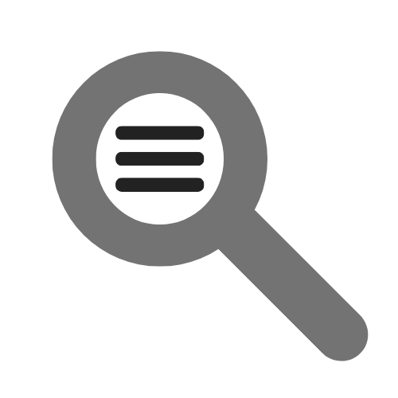

<div align="center">



# ContextLens

**The AI context layer for your codebase.**

Track coding intent, capture AI interactions, and expose your development history to any MCP-compatible AI client.

[](https://marketplace.visualstudio.com/items?itemName=Noventra-Labs.contextlens)
[](LICENSE)
[](https://github.com/Noventra-labs/Contextlens/actions)
[](https://nodejs.org)

[Installation](#-installation) · [Features](#-features) · [Quick Start](#-quick-start) · [Architecture](#-architecture) · [Documentation](#-documentation) · [Contributing](#-contributing)

</div>

---

> [!WARNING]
> **ContextLens is under active development.** Some features are in preview and may change without notice.

## 🤔 Why ContextLens?

Every coding session generates context that AI tools lose between conversations. ContextLens captures the *why* behind every change — diffs, AI interactions, decisions — and makes it available to any AI client through the **Model Context Protocol (MCP)**.

**Without ContextLens:** Each AI session starts from scratch, re-analyzing your code.
**With ContextLens:** AI tools access your full development history, past decisions, and project context.

## ✨ Features

### Episode-Based Context Tracking
- Organize work into logical episodes (features, bugfixes, refactors)
- Automatically capture diffs and AI interactions
- Build a semantic history of your project

### MCP Server (Model Context Protocol)
- **9 Tools**: Status, episodes, AI logging, diff explanation, context search
- **5 Resources**: Workspace state, git diff, episodes, diagnostics, symbols
- **5 Prompts**: Code review, test generation, security audit, diff explanation
- Works with Claude Desktop, Cursor, Antigravity IDE, Gemini CLI, and more

### Security-First Design
- Rotating authentication tokens (30-min TTL)
- Per-client rate limiting with burst protection
- Input validation on all tool calls
- Local-only binding (127.0.0.1)

### Developer Dashboard
- Visual timeline of project progress
- AI-generated PR descriptions and impact assessments
- Branch-level analysis

## 🎯 Supported MCP Clients

| Client | Status | Setup |
|--------|--------|-------|
| Claude Desktop | ✅ Supported | Auto-setup or manual |
| Cursor | ✅ Supported | Auto-setup or manual |
| Antigravity IDE | ✅ Supported | Manual config |
| VS Code Agent | ✅ Built-in | Automatic |
| Gemini CLI | ✅ Supported | Manual config |
| OpenAI Agents SDK | ✅ Supported | Python integration |

## 📦 Installation

### VS Code Extension

```bash
# From VS Code Marketplace
ext install Noventra-Labs.contextlens
```

Or search **"ContextLens"** in the VS Code Extensions panel.

### MCP Bridge (npm)

```bash
npm install -g @contextlens/mcp
```

### Auto-Setup for AI Clients

1. Install the VS Code extension
2. Open Command Palette → **ContextLens: Auto-Setup MCP in AI Clients**
3. Done! Your AI client can now access ContextLens tools.

### Manual Setup

Add to your AI client's MCP configuration:

```json
{
  "contextlens": {
    "command": "node",
    "args": ["/path/to/mcp-bridge.js"]
  }
}
```

Use **ContextLens: Copy MCP Configuration** to get the correct path.

## 🚀 Quick Start

### 1. Start an Episode

Ask your AI client:
> "Use the start_episode tool to begin tracking my work on the login feature"

### 2. Code as Usual

ContextLens automatically captures:
- Git diffs
- AI interactions
- File changes

### 3. Get Context

Ask your AI client:
> "What changes have I made in this episode? Use explain_diff to analyze them."

### 4. Search Past Work

> "Search my past episodes for anything related to authentication using search_context"

## 🏗️ Architecture

```
┌─────────────────────┐         ┌─────────────────────────────────┐
│   AI Client         │         │   VS Code Extension             │
│   (Claude, Cursor)  │         │                                 │
└────────┬────────────┘         │  ┌───────────────────────────┐  │
         │ stdio JSON-RPC       │  │  ToolRegistry (9 tools)   │  │
         ▼                      │  ├───────────────────────────┤  │
┌────────┴────────────┐         │  │  Resources (5 URIs)       │  │
│   mcp-bridge.js     │◄───HTTP─│  ├───────────────────────────┤  │
│   (MCP Server)      │ :3012   │  │  Prompts (5 templates)    │  │
└─────────────────────┘         │  ├───────────────────────────┤  │
                                │  │  Security Layer           │  │
                                │  │  ├── TokenManager         │  │
                                │  │  ├── RateLimiter          │  │
                                │  │  └── InputValidator       │  │
                                │  └───────────────────────────┘  │
                                └─────────────────────────────────┘
```

### Repository Structure

| Component | Path | Description |
|-----------|------|-------------|
| **VS Code Extension** | [`/vscode-extension`](./vscode-extension/) | Primary client with MCP server |
| **MCP Implementation** | [`/vscode-extension/src/mcp/`](./vscode-extension/src/mcp/) | Tools, resources, prompts, security |
| **MCP Bridge** | [`/vscode-extension/mcp-bridge.js`](./vscode-extension/mcp-bridge.js) | stdio JSON-RPC bridge for AI clients |
| **Web Dashboard** | [`/contextlens-dashboard`](./contextlens-dashboard/) | React-based visual interface |
| **Backend** | [`/src`](./src/) | Firebase Cloud Functions + Firestore |
| **Documentation** | [`/docs`](./docs/) | Architecture, API, tutorials |

## 📖 Documentation

| Document | Description |
|----------|-------------|
| [Getting Started](docs/mcp/GettingStarted.md) | Installation and first steps |
| [Architecture](docs/mcp/Architecture.md) | System design and data flow |
| [Security](docs/mcp/Security.md) | Authentication, rate limiting, error codes |
| [Examples](docs/mcp/Examples.md) | Client configuration examples |
| [API Reference](docs/mcp/APIReference.md) | Tools, resources, prompts reference |
| [Troubleshooting](docs/mcp/Troubleshooting.md) | Common issues and solutions |
| [FAQ](docs/mcp/FAQ.md) | Frequently asked questions |

## 🤝 Contributing

We welcome contributions! See [CONTRIBUTING.md](CONTRIBUTING.md) for:
- Development setup
- Branch naming and commit conventions
- How to add new MCP tools and resources
- Testing requirements

## 🔒 Security

Found a vulnerability? Please see [SECURITY.md](SECURITY.md) for responsible disclosure.

## 📋 Roadmap

See [ROADMAP.md](ROADMAP.md) for planned features and milestones.

## 📄 License

This project is licensed under the MIT License — see [LICENSE](LICENSE) for details.

---

<div align="center">

Built with ❤️ by [Noventra Labs](https://github.com/Noventra-labs)

[⭐ Star this repo](https://github.com/Noventra-labs/Contextlens) · [🐛 Report Bug](https://github.com/Noventra-labs/Contextlens/issues/new?template=bug_report.yml) · [💡 Request Feature](https://github.com/Noventra-labs/Contextlens/issues/new?template=feature_request.yml)

</div>
