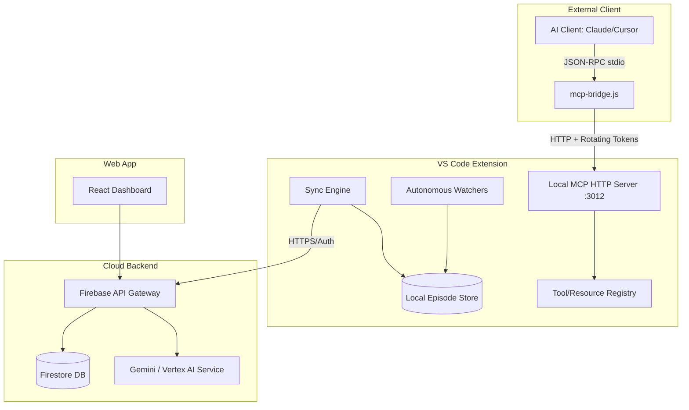

# ContextLens Website Design Plan

This document outlines the detailed findings from the codebase deep scan and the complete layout, structure, and design system for a premium, high-fidelity marketing and documentation website for ContextLens.

---

## 🔍 Codebase Deep Scan Insights

The deep scan of the ContextLens codebase reveals a highly modular, secure, and offline-first developer companion system.



### 1. VS Code Extension Capabilities
* **Autonomous Watchers**: Monitors file changes, text edits, active document selections, terminal commands, and TODO/issue markers.
* **Sync Engine**: Periodically pushes cached local episode data to Firebase, handling conflicts, auth headers, and offline modes.
* **UI Elements**: Status bar showing active episode/sync state; Tree view showing active project, recent episodes, and sync health; sidebar chat view.
* **Secret Storage**: Securely caches third-party API keys (Gemini, OpenAI, Anthropic) in the VS Code Secrets store.

### 2. Model Context Protocol (MCP) Server
* **9 Tools**: `get_status`, `start_episode`, `close_episode`, `log_ai_call`, `explain_diff`, `search_context`, `get_episode_details`, `get_recent_episodes`, `explain_past_changes`.
* **5 Resources**: `workspace://current`, `workspace://git-diff`, `workspace://episodes`, `workspace://diagnostics`, `workspace://symbols`.
* **5 Prompts**: `explain_diff`, `review_code`, `generate_tests`, `security_audit`, `summarize_episode`.
* **Security Pipeline**: 30-min rotating tokens with a 1-min grace period; token-bucket rate limiter; lightweight input schema validation.

### 3. Dashboard Web App
* **Tech Stack**: React, TypeScript, TailwindCSS, Vite.
* **Pages**:
  * **LoginPage**: Firebase Authentication.
  * **HomePage / Projects**: Overview of active projects and workspace settings.
  * **ProjectPage**: Detailed timeline of coding episodes, branching structure, and sync statistics.
  * **EpisodeDetailPage**: Diffs, AI calls, file change lists, and summaries.
  * **BranchPage**: Commits, PR summaries, and change audit trails.
  * **SearchPage**: [SearchPage](file:///c:/Users/shasa/Projects/ContextLens/contextlens-dashboard/src/pages/SearchPage.tsx) - Semantic query interface.
  * **SettingsPage**: API keys, notification setup, custom providers.

---

## 🎨 Website Visual & Interaction Design

The website will be built with **sleek dark mode aesthetics** (dark space-themed palette with neon blue, purple, and green accent highlights), glassmorphism cards, and smooth micro-animations.

### 1. Color Palette (Tailwind / CSS Variables)
* **Background**: Deep space charcoal (`#0B0F17`)
* **Primary / Accents**: Electric Cyan (`#00F2FE`), Neon Purple (`#4FACFE`), Neon Mint (`#00FF87`)
* **Card Fills**: Semi-transparent dark navy (`rgba(16, 22, 35, 0.6)`) with subtle borders (`rgba(255, 255, 255, 0.08)`)

### 2. Typography
* **Headers**: Modern geometric sans-serif (e.g., *Outfit* or *Inter*)
* **Code / CLI**: High-contrast monospaced (e.g., *JetBrains Mono* or *Fira Code*)

---

## 🗺️ Website Information Architecture

```
├── Home (Hero, Value Proposition, Interactive MCP Terminal Demo)
├── Features (Deep dive into watchers, offline sync, dashboard timelines)
├── MCP Gateway (Protocol details, tools/resources explorer)
├── Docs (API Reference, Getting Started, Troubleshooting guides)
└── Showcase (Demo GIF, screenshots, integrations list)
```

### 🖥️ Key Landing Page Components
1. **Interactive Hero Header**: Large tagline with animated glow text + glowing CTA buttons.
2. **"MCP Stdio Bridge" Simulation**: A mock command-line interface demonstrating:
   ```bash
   npx @contextlens/cli mcp doctor
   ```
   Users can click commands and see interactive outputs in real-time.
3. **Watchers Visual Representation**: A live-updating tree view visualization showing how file saves and terminal commands automatically build context in the background.
4. **Three-Tier Architecture Card Deck**: Interactive glassmorphism cards explaining the Extension, the Bridge, and the Cloud Dashboard.

---

## 🚀 Recommended Implementation Plan

1. **Phase 1: Setup & CSS Foundations** (Vite + Tailwind / Vanilla CSS setup, typography tokens, base layouts).
2. **Phase 2: Visual Hero & Interactive CLI Terminal** (Landing page layout, interactive shell terminal mockup, responsive navigation).
3. **Phase 3: Features & Architecture Visualizer** (Watchers simulator, MCP API explorer, detailed documentation viewer).
4. **Phase 4: Optimization & Responsiveness** (Responsive test on mobile, fast asset preloading, print-friendly docs).
