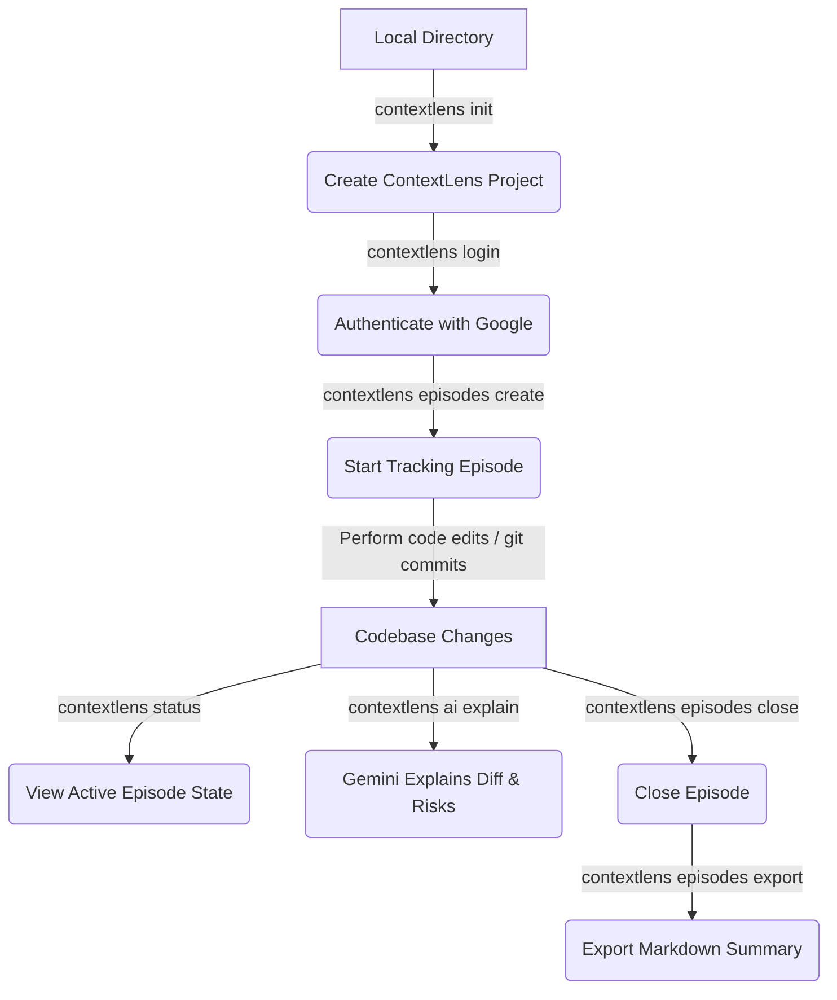

#   ContextLens CLI

> **Bridge the gap between codebase evolution and design intent directly from your terminal.**

ContextLens is an AI-powered developer companion that captures your development story. It organizes your code edits, git commits, and AI interactions into structured **Episodes**, providing team members and stakeholders with deep visibility into the *why* behind the *what*. 

With the ContextLens CLI, you can manage your projects, start tracking episodes, search your history, and trigger Gemini-powered AI analysis of diffs and branches—all without leaving the command line.

---

##  Key Features

*   ** Secure Authentication:** Sign in securely using your Google Account via OAuth.
*   ** Automatic Project Detection:** Initialize project configurations directly from your git repository.
*   ** Episode Tracking:** Group related code changes, branch history, and AI explanations into logical units.
*   ** Gemini AI Insights:** Analyze diffs, highlight risk areas, and generate automated pull request summaries.
*   ** Semantic Search:** Query history across projects, episodes, and AI conversations.
*   ** Dashboard Integration:** Smoothly open and sync with the web-based ContextLens dashboard.

---

##  How It Works



---

##  Installation

Ensure you have **Node.js v16.0.0 or higher** installed. Install the CLI globally via `npm`:

```bash
npm install -g @noventra-labs/contextlens-cli
```

---

##  Quick Start

Get up and running in under two minutes:

### 1. Authenticate
Log in securely with your Google Account:
```bash
contextlens login
```
Verify your session at any time:
```bash
contextlens whoami
```

### 2. Initialize a Project
Navigate to your repository and initialize your workspace:
```bash
contextlens init
```
> [!NOTE]
> This command automatically detects your folder name, git remote origin URL, and current branch to link it with ContextLens.

### 3. Create an Episode
Start tracking a new logical task or feature:
```bash
contextlens episodes create --label "auth-flow-overhaul"
```

### 4. Ask Gemini for Insights
Once you have changes staged, let Gemini explain the current episode's diff and identify risks:
```bash
contextlens ai explain --episode <episode-id>
```

### 5. Launch the Web Dashboard
Visualize your projects and episodes in a sleek dashboard:
```bash
contextlens dashboard
```

---

##  Command Reference

Run `contextlens --help` or `contextlens [command] --help` to get the latest options and flags directly in your terminal.

###  Authentication

| Command | Description |
| :--- | :--- |
| `contextlens login` | Opens browser for OAuth Google Sign-In |
| `contextlens logout` | Logs out and destroys local cached credentials |
| `contextlens whoami` | Displays current authenticated user's email |
| `contextlens status` | Displays current session status, Git metadata, and open episodes |

### 📁 Project Management

| Command | Description | Options & Flags |
| :--- | :--- | :--- |
| `contextlens init` | Link local folder as project (detects Git repo url/branch) | `-n, --name <name>` Project name (defaults to folder) |
| `contextlens config` | Get/set active configuration | `-p, --project <id>` Set default active project ID |
| `contextlens projects create` | Create a new project on the server | **Required:** `-n, --name <name>`<br>Optional:<br>`-r, --repo <url>` Repository URL<br>`-w, --workspace <name>` Local workspace name<br>`-b, --branch <name>` Default branch (default: `main`) <br>`-d, --set-default` Set as default project |
| `contextlens projects list` | List linked projects (referrals dashboard) | None |

###  Episode Management

Manage chronological development tracking.

| Subcommand | Description | Options & Flags |
| :--- | :--- | :--- |
| `contextlens episodes list` | List episodes for a project | `-p, --project <id>` Override project ID<br>`-l, --limit <n>` Limit output (default: 20)<br>`-a, --all` Include closed episodes |
| `contextlens episodes create` | Start a new tracking episode | `-p, --project <id>` Override project ID<br>`-b, --branch <name>` Tracked branch (default: `main`) <br>`--label <label>` Human-readable label |
| `contextlens episodes close` | Mark an episode as closed | **Required:** `-e, --episode <id>`<br>`-p, --project <id>` Override project ID |
| `contextlens episodes get` | Show details and list AI interaction history | **Required:** `-e, --episode <id>`<br>`-p, --project <id>` Override project ID |
| `contextlens episodes export` | Export episode log and diff summary to markdown file | **Required:** `-e, --episode <id>`<br>`-p, --project <id>` Override project ID<br>`-o, --output <file>` File path (default: `episode-<id>.md`) |

### 🧠 AI Insights

Power your terminal workflow with Gemini.

| Subcommand | Description | Options & Flags |
| :--- | :--- | :--- |
| `contextlens ai explain` | Analyzes diff of the given episode and lists risks/review checks | **Required:** `-e, --episode <id>` <br>`-p, --project <id>` Override project ID |
| `contextlens ai summarize` | Summarizes changes on a branch compared to base, drafting PR notes | **Required:** `-b, --branch <name>` <br>`-p, --project <id>` Override project ID |

### 🔍 Search

| Command | Description | Options & Flags |
| :--- | :--- | :--- |
| `contextlens search` | Search episodes and AI conversations semantically | **Required:** `-q, --query <text>` Search term<br>`-p, --project <id>` Override project ID |

---

## ⚙️ Local Configuration

ContextLens stores persistent configurations and credentials in your user home directory:

*   **Location:** `~/.contextlens/` (or `%USERPROFILE%\.contextlens\` on Windows)
*   **Files:**
    *   `credentials.json`: Google OAuth access tokens & refresh tokens.
    *   `config.json`: Default project IDs, CLI settings, and API configurations.

> [!WARNING]
> Keep the contents of `~/.contextlens/` private. Never commit your `credentials.json` to source control.

---

## 📄 License

MIT License. See root directory for details.
