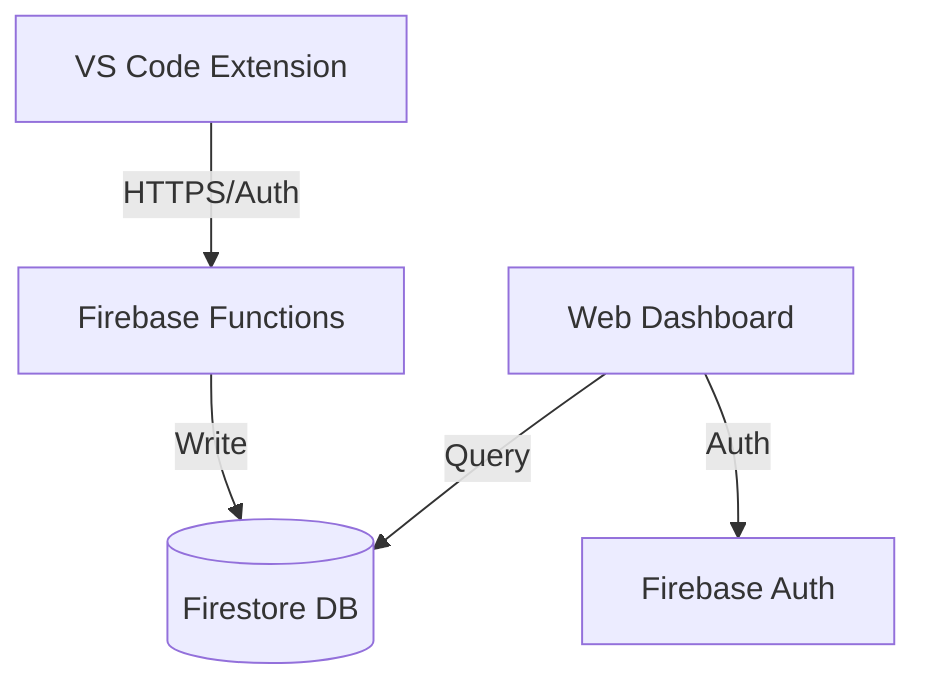

# ContextLens — Comprehensive Documentation

> **Vision**: To eliminate the context-loss problem in software development by capturing the *intent* and *evolution* of code in real-time.

---

## 📖 Table of Contents
1. [System Architecture](#-system-architecture)
2. [Component Deep-Dive](#-component-deep-dive)
   - [VS Code Extension](#vs-code-extension)
   - [Web Dashboard](#web-dashboard)
   - [Backend Services](#backend-services)
3. [Core Concepts](#-core-concepts)
   - [Episodes](#episodes)
   - [Intent Capture](#intent-capture)
   - [Semantic History](#semantic-history)
4. [Getting Started](#-getting-started)
5. [Security & Privacy](#-security--privacy)
6. [Contributing](#-contributing)

---

## 🏗️ System Architecture

ContextLens operates as a distributed system with multiple capture points and a centralized processing engine.

### Data Flow
1. **Capture**: The VS Code Extension captures developer activity (AI chats, text changes, git diffs).
2. **Buffering**: Data is buffered locally (especially in the extension) to ensure zero data loss during offline periods.
3. **Synchronization**: The Sync Engine flushes data to the Firebase Backend via HTTPS.
4. **Storage**: Data is stored in Firestore, organized by `Project` -> `Episode` -> `Call`.
5. **Visualization**: The Web Dashboard queries Firestore to reconstruct a visual timeline of the project's development.

---

## 🧩 Component Deep-Dive

### VS Code Extension
The "Heart" of ContextLens. It monitors the IDE state and captures the most granular context.
- **Sync Engine**: A robust background process that ensures data is sent to the backend without blocking the UI.
- **Status Bar**: Provides immediate feedback on active episodes and sync status.
- **Webview UI**: (Upcoming) Interactive chat and project summary interface.

### Web Dashboard
A **React + Vite** application designed for high-end visual storytelling.
- **Glassmorphism Design**: Uses a premium aesthetic with radial gradients and backdrop blurs.
- **Timeline View**: Reconstructs development history as a series of expandable "Episodes".
- **Interactive Diffs**: Allows users to see code changes exactly as they happened, with AI-generated explanations.

### Backend Services
Built on **Firebase Cloud Functions (Gen 2)** and **Firestore**.
- **Auth**: Uses Firebase Authentication (Google Provider).
- **Security**: Strict Firestore rules ensure users can only access their own project data.
- **Scalability**: Stateless functions allow for infinite scaling of capture events.

---

## 💡 Core Concepts

### Episodes
An Episode is a logical unit of work. Instead of just "Commits," ContextLens tracks "Episodes."
- **Example**: "Refactoring the Auth Logic" or "Implementing the Search Bar."
- An episode spans multiple commits, branches, and AI interactions.

### Intent Capture
Unlike Git, which captures *what* changed, ContextLens captures *why* it changed by logging the prompts and AI responses that led to the code modification.

### Semantic History
The end result is a "Semantic History"—a searchable, human-readable record of the project's evolution that is much more useful for onboarding new developers than raw git logs.

---

## 🚀 Getting Started

ContextLens is designed to be set up in minutes. Follow these steps to start capturing your development context.

### 1. Install the VS Code Extension
The extension handles real-time capture while you code.
1. Open VS Code.
2. Go to the Extensions view (`Ctrl+Shift+X`).
3. Search for "ContextLens" and install.
4. You will see a `CL` icon in your status bar.

### 2. Log In & Authenticate
To sync your data, you need to authenticate with your ContextLens account.
1. Click the `CL` status bar item or open the Command Palette (`Ctrl+Shift+P` / `Cmd+Shift+P`).
2. Run command **ContextLens: Sign In**.
3. Your browser will open the sign-in page. Complete authentication to link your VS Code environment.

### 3. Track Your First Episode
ContextLens automatically fingerprints your git project based on its repository URL.
To start a manual capture session (Episode):
1. Open Command Palette.
2. Run **ContextLens: New Episode**.
3. Enter the title of your episode (e.g., "Implementing user login flow").

### 4. View the Dashboard
To see your progress visualized:
1. Click the globe/dashboard icon in the ContextLens view header, or run **ContextLens: Open Dashboard**.
2. Navigate to the [ContextLens Web Dashboard](http://localhost:5173).
3. Explore your project timeline and AI insights.

---

## 🛠️ Advanced: Self-Hosting (Optional)
If you want to host your own ContextLens backend, refer to the [Backend Setup Guide](../src/README.md) for Firebase configuration.

---

## 🛡️ Security & Privacy

ContextLens is designed with privacy in mind:
- **Redaction**: The Extension includes utilities to scrub API keys and PII before they leave your machine.
- **Data Sovereignty**: Since the backend is a standard Firebase app, you can host your own "ContextLens Server" easily.
- **Authentication**: All data is protected by industry-standard Firebase Auth.

---

## 🤝 Contributing

We welcome contributions! Please see [CONTRIBUTING.md](./CONTRIBUTING.md) for detailed guidelines on how to get started.

---

## 📜 License

ContextLens is open-source software licensed under the [MIT License](../LICENSE).
